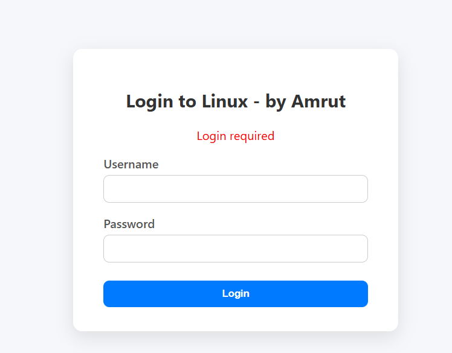
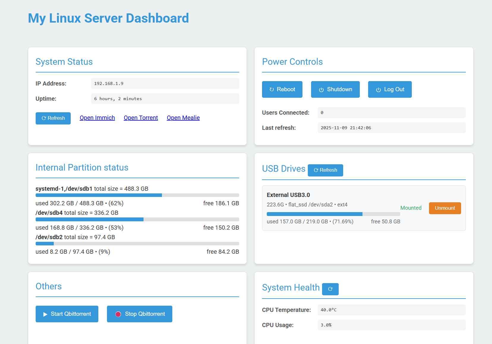

# Dashboard-for-Linux-server
A lightweight **Flask-based web tool** for quick and safe local linux server management  - without needing to enter terminal   Inspired by [Cockpit](https://cockpit-project.org/), but intentionally **trimmed down** to limited features.

---

## 🚀 Overview

This project provides a **simple web interface** to perform everyday tasks like:

|   |   |
|---|---|
| Power Control | Shutdown / Reboot buttons |
| Storage view | View disk space usage across multiple drives |
| USB Management | Mount / Unmount USB drives with one click |
| Shortcuts (1) | Run commands to manage services , provided as buttons |
| Shortcuts (2) | Quick links to  services running on the server  |

Built using:
- 🐍 **Python & Flask library** for backend logic  
- 🌐 **HTML / CSS / JavaScript** for frontend presentation  

---

## 💡 Motivation

The [Cockpit project](https://cockpit-project.org/) is excellent, but in some cases:
- It exposes **too many system-level features** in admin mode,  
- A single misclick can trigger **irreversible damage**, and  
- It’s **overkill** when you just want basic local management.

This project basically reinvents the wheel, but in my method and added to my learning   
It gives just enough functionality for quick system checks and controls without the overhead or risk.

---

## 📸 Snapshots

Note - front-end (html/css/js) is generated by AI assitance. I'm not the sole author there.

### Limitations
- Only works for local server
- Only single user is supported at this time (i.e. the admin)
- Non-admin mode not  supported (like cockpit)
- no terminal support in web interface